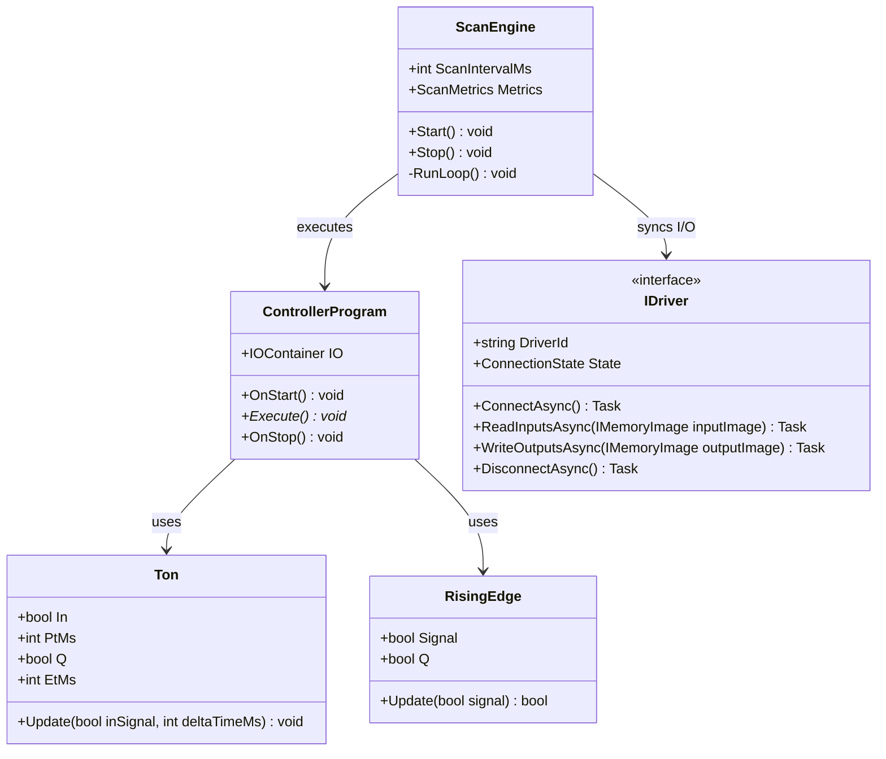
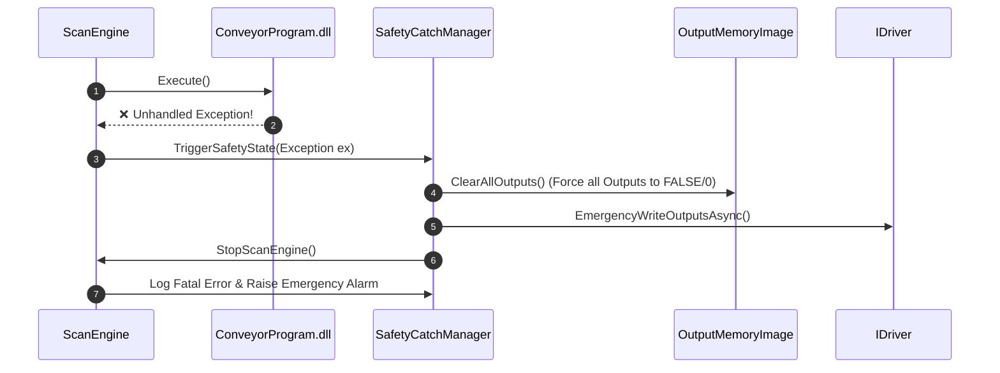

# 🎨 TECHNICAL DESIGN: DBI.Controller (Soft PLC Runtime)

**Ngày tạo:** 2026-07-23  
**Dựa trên:** [docs/BRIEF.md](file:///c:/Users/ducbu/Documents/GitHub/DBI.SoftPLC/docs/BRIEF.md) & [plans/260723-2230-dbi-controller/plan.md](file:///c:/Users/ducbu/Documents/GitHub/DBI.SoftPLC/plans/260723-2230-dbi-controller/plan.md)  
**Tác giả:** Antigravity Solution Architect  

---

## 1. KIẾN TRÚC TỔNG QUAN (SYSTEM ARCHITECTURE)

```
┌─────────────────────────────────────────────────────────────────────────────────┐
│                                 USER DLL                                        │
│                        ConveyorProgram.dll (SDK)                                │
└──────────────────────────────────────┬──────────────────────────────────────────┘
                                       │ Inherits ControllerProgram
                                       ▼
┌─────────────────────────────────────────────────────────────────────────────────┐
│                             DBI.CONTROLLER.RUNTIME                              │
│                                                                                 │
│   ┌─────────────────────────────────────────────────────────────────────────┐   │
│   │                          SCAN ENGINE LOOP (20ms)                        │   │
│   │                                                                         │   │
│   │   1. Read Inputs Snapshot ──► 2. Execute Logic() ──► 3. Write Output    │   │
│   └────────────────────────────────────┬────────────────────────────────────┘   │
│                                        │                                        │
│   ┌────────────────────────────────────┴────────────────────────────────────┐   │
│   │                     LOCK-FREE MEMORY IMAGE MANAGER                      │   │
│   │             [Input Image Snapshot]      [Output Image Snapshot]         │   │
│   └────────────────────────────────────┬────────────────────────────────────┘   │
│                                        │                                        │
│   ┌────────────────────────────────────┴────────────────────────────────────┐   │
│   │                           DRIVER MANAGER & HOST                         │   │
│   │         AssemblyLoadContext  |  SafetyCatch  |  Diagnostics            │   │
│   └────────────────────────────────────┬────────────────────────────────────┘   │
└────────────────────────────────────────┼────────────────────────────────────────┘
                                         │ IDriver Interface
                                         ▼
┌─────────────────────────────────────────────────────────────────────────────────┐
│                            DEVICE DRIVERS (PLUGINS)                             │
│       [SimulationDriver]     [ModbusTcpDriver]     [FactoryIODriver]            │
└────────────────────────────────────────┬────────────────────────────────────────┘
                                         │ Physical / Network Protocols
                                         ▼
                               [HARDWARE / SIMULATOR]
```

---

## 2. CƠ CHẾ MEMORY IMAGE & SCAN CYCLE (MEMORY SNAPSHOT)

### 2.1. Chu kỳ Scan Cycle (Scan Loop)
Mỗi chu kỳ Scan Cycle (mặc định **20ms**) được thực thi trên Thread riêng với `ThreadPriority.Highest`:

```
┌──────────────────────────────────────────────────────────────────────────────────────────┐
│                                 ONE SCAN CYCLE (20ms)                                    │
│                                                                                          │
│ ┌─────────────────────────┐   ┌─────────────────────────┐   ┌─────────────────────────┐  │
│ │  1. READ INPUTS         │   │  2. EXECUTE LOGIC       │   │  3. WRITE OUTPUTS       │  │
│ │  Driver Buffer          │   │  ControllerProgram      │   │  Output Image           │  │
│ │         ▼               │   │         .Execute()      │   │         ▼               │  │
│ │  Input Image Snapshot   │   │  Reads:  IO.StartButton │   │  Driver Write Buffer    │  │
│ │  (Lock-free Interlocked)│   │  Writes: IO.Conveyor    │   │  (Lock-free Interlocked)│  │
│ └────────────┬────────────┘   └────────────┬────────────┘   └────────────┬────────────┘  │
│              │                             │                             │               │
└──────────────┼─────────────────────────────┼─────────────────────────────┼───────────────┘
               ▼                             ▼                             ▼
       Duration: ~0.1ms              Duration: ~0.5ms              Duration: ~0.1ms
       ─────────────────────────────────────────────────────────────────────────────
       Remaining Time (~19.3ms): High-Precision Wait (Stopwatch / PeriodicTimer)
```

### 2.2. Lock-free Double/Triple Buffering Interface Design

```csharp
namespace DBI.Controller.Core.Interfaces
{
    public interface IMemoryImage
    {
        bool GetBool(int index);
        void SetBool(int index, bool value);
        int GetInt(int index);
        void SetInt(int index, int value);
        float GetFloat(int index);
        void SetFloat(int index, float value);
        
        void SwapInputBuffers();
        void SwapOutputBuffers();
    }
}
```

---

## 3. DESIGN CHI TIẾT CÁC LỚP CORE & SDK (CLASS DIAGRAM)



---

## 4. QUẢN LÝ DẠNG CẶP SỰ CỐ & SAFETY CATCH (EMERGENCY SAFE STATE)

Khi User Logic trong DLL ném unhandled Exception (như `NullReferenceException`, `DivideByZeroException`):



---

## 5. BÀI KIỂM TRA & TEST CASES (ACCEPTANCE CRITERIA)

### TC-01: High-Precision Scan Cycle
- **Given:** Scan Engine được cấu hình `ScanIntervalMs = 20`.
- **When:** Chạy 1000 chu kỳ Scan.
- **Then:** Thời gian trung bình mỗi chu kỳ đạt 20ms (độ lệch/jitter < 2ms).

### TC-02: Safety Catch trên Unhandled Exception
- **Given:** Program đang điều khiển `IO.Conveyor = true`.
- **When:** `Execute()` ném Exception cố ý.
- **Then:** Toàn bộ `OutputMemoryImage` lập tức trở về `FALSE`, Driver ghi giá trị `0` xuống thiết bị trong < 1ms, Scan Engine chuyển trạng thái `FAULTED`.

### TC-03: Industrial Timer (`Ton`) Accuracy
- **Given:** `Ton delay = new Ton(1000);` (Delay 1000ms).
- **When:** `delay.In = true` và Scan Engine chạy qua 50 chu kỳ 20ms (tổng 1000ms).
- **Then:** `delay.Q` trở thành `TRUE` tại đúng mốc 1000ms.

### TC-04: Simulation & Modbus Driver Swap
- **Given:** `ConveyorProgram` đang chạy trên `SimulationDriver`.
- **When:** Đổi cấu hình Driver sang `ModbusDriver` trong file config mà KHÔNG sửa code `ConveyorProgram.cs`.
- **Then:** Logic điều khiển băng tải hoạt động chính xác tương tự qua chuẩn Modbus TCP.

---

## 6. HANDOVER & TIẾP THEO

Bản thiết kế kỹ thuật **`docs/DESIGN.md`** đã hoàn thiện 100%.

➡️ **Các lựa chọn tiếp theo:**
1️⃣ **Bắt đầu triển khai Code Phase 1 ngay (`/code phase-01`)**  
2️⃣ **Xem lại file [docs/DESIGN.md](file:///c:/Users/ducbu/Documents/GitHub/DBI.SoftPLC/docs/DESIGN.md)**  
3️⃣ **Chỉnh sửa / Bổ sung thêm thiết kế**
