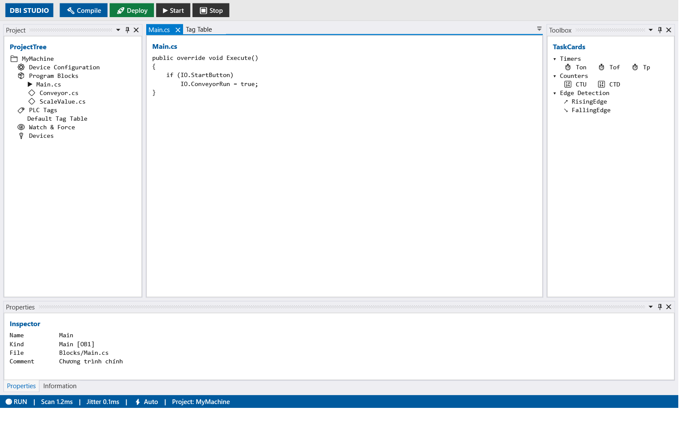
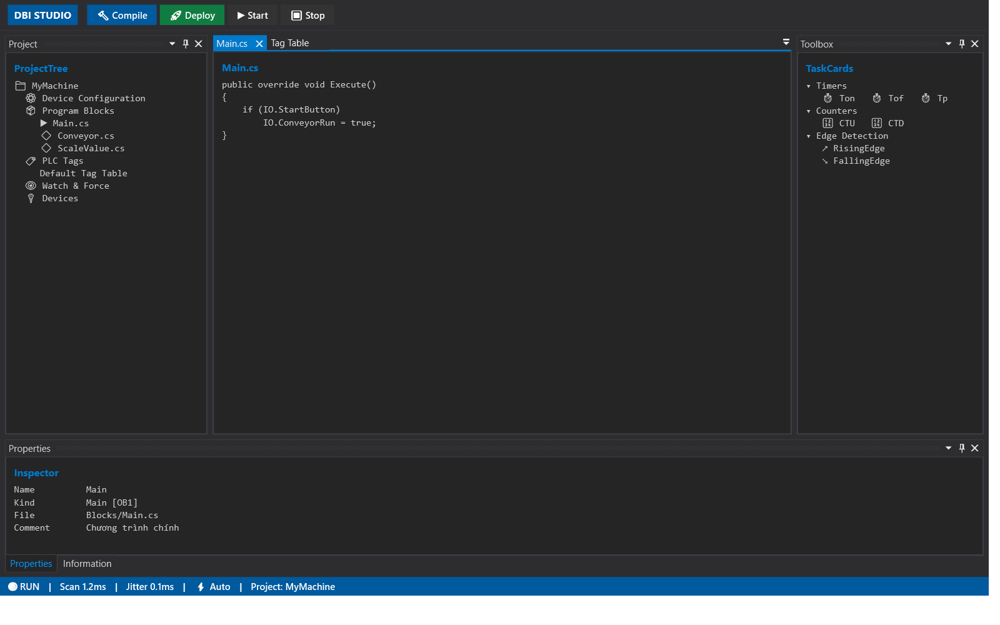

# Spike Report — AvalonDock

**Ngày:** 2026-07-27 | **Phase:** 00 | **Quyết định phụ thuộc:** phase-04, [ADR-003](../decisions/ADR-003-shell-avalondock.md)

# ✅ KẾT LUẬN: DÙNG ĐƯỢC

**7/7 test PASS.** Rủi ro theming nêu trong [BRIEF-STUDIO.md §8.5](../../../docs/BRIEF-STUDIO.md) **không xảy ra** — theme VS2013 đè brush được về bảng màu flat industrial hiện có, cả Light lẫn Dark.

---

## Môi trường

| Mục | Giá trị |
|---|---|
| `Dirkster.AvalonDock` | 4.74.1 |
| `Dirkster.AvalonDock.Themes.VS2013` | 4.74.1 |
| TFM | `net10.0-windows` · .NET 10.0.10 |
| Cảnh báo restore | **0** |

Theme có sẵn: `Vs2013LightTheme`, `Vs2013DarkTheme`, `Vs2013BlueTheme`.

---

## Kết quả bằng hình

### Light — giữ nguyên phong cách flat industrial



### Dark — đổi lúc runtime, chrome của AvalonDock đổi theo



Bảng màu dùng đúng token đang có trong `MainViewModel` (commit `83518a4` / `5c0a02d`):

| Token | Light | Dark |
|---|---|---|
| `WindowBg` | `#F3F3F3` | `#1E1E1E` |
| `CardBg` | `#FFFFFF` | `#252526` |
| `HeaderBg` | `#E8E8E8` | `#2D2D30` |
| `TextPrimary` | `#1A1A1A` | `#CCCCCC` |
| `BorderColor` | `#CCCCCC` | `#3F3F46` |
| `Accent` | `#005A9E` | `#007ACC` |

Accent `#005A9E`, xanh `#107C41`, đỏ `#C72C3B` giữ nguyên.

---

## Bảng test

| ID | Nội dung | Kết quả |
|---|---|---|
| T1 | Nạp theme VS2013 | ✅ 3 theme |
| T2 | Dựng shell 4 vùng | ✅ Project tree \| Documents \| Inspector \| Task cards |
| T3 | Theme Light + đè brush về industrial | ✅ |
| T4 | Đổi Light → Dark lúc runtime | ✅ chrome AvalonDock đổi theo |
| T5 | Lưu / khôi phục layout | ✅ 1414 bytes; 2 doc → đóng còn 1 → khôi phục 2 |
| T6 | Float panel ra cửa sổ riêng rồi Dock lại | ✅ |
| T7 | Auto-hide (thu gọn ra mép) | ✅ |

---

## Cách theme (đã kiểm chứng)

Hai lớp: đặt theme của `DockingManager`, rồi **đè** brush qua `Application.Resources.MergedDictionaries`.

```csharp
dm.Theme = dark ? new Vs2013DarkTheme() : new Vs2013LightTheme();

var rd = new ResourceDictionary {
    ["WindowBg"] = Brush("#F3F3F3"), ["CardBg"] = Brush("#FFFFFF"),
    ["HeaderBg"] = Brush("#E8E8E8"), ["BorderColor"] = Brush("#CCCCCC"),
    ["TextPrimary"] = Brush("#1A1A1A"), ["Accent"] = Brush("#005A9E"),
    // đè brush nội bộ của AvalonDock
    ["AvalonDock_ThemeVS2013_BaseColor11"] = Brush("#F3F3F3"),
};
app.Resources.MergedDictionaries.Remove(oldPaletteDictionary);
app.Resources.MergedDictionaries.Add(rd);
```

Content trong panel dùng `SetResourceReference` (tương đương `DynamicResource` trong XAML) để đổi theme có hiệu lực ngay:

```csharp
border.SetResourceReference(Border.BackgroundProperty, "CardBg");
```

> Đây chính là lý do phase-04 Task 04.2 phải chuyển theme token từ **string binding trên ViewModel** sang `ResourceDictionary`. Cách cũ (`{Binding WindowBg}` trả về `string`) **không** theme được AvalonDock.

---

## Dựng shell 4 vùng

```csharp
var leftPane   = new LayoutAnchorablePane(projectTree) { DockWidth  = new GridLength(260) };
var rightPane  = new LayoutAnchorablePane(taskCards)   { DockWidth  = new GridLength(240) };
var bottomPane = new LayoutAnchorablePane(inspector)   { DockHeight = new GridLength(170) };
bottomPane.Children.Add(information);          // Inspector nhiều tab

var middleRow = new LayoutPanel(leftPane) { Orientation = Orientation.Horizontal };
middleRow.Children.Add(new LayoutDocumentPaneGroup(docPane));
middleRow.Children.Add(rightPane);

var root = new LayoutPanel(middleRow) { Orientation = Orientation.Vertical };
root.Children.Add(bottomPane);

dm.Layout = new LayoutRoot { RootPanel = root };
```

Toàn bộ dựng bằng **code**, không cần XAML — hợp với MVVM của phase-04.

---

## 🟡 Lưu ý cho phase-04

**Khôi phục layout cần callback gắn lại content.** File `layout.xml` chỉ lưu cấu trúc và `ContentId`, không lưu content. Thiếu callback thì panel khôi phục ra rỗng:

```csharp
var ser = new XmlLayoutSerializer(dm);
ser.LayoutSerializationCallback += (s, e) => { e.Content = ResolvePane(e.Model.ContentId); };
ser.Deserialize(path);
```

→ `ShellViewModel` phải có bảng tra `ContentId` → ViewModel. Đây là lý do mọi pane cần `ContentId` ổn định, không đổi giữa các phiên.

---

## Việc cần thêm vào plan

| # | Việc | Phase |
|---|---|---|
| 1 | Theme token chuyển sang `ResourceDictionary` + `DynamicResource` — **điều kiện cần** để theme AvalonDock | 04 |
| 2 | `ShellViewModel` giữ bảng tra `ContentId` → ViewModel cho `LayoutSerializationCallback` | 04 |
| 3 | Mọi pane phải có `ContentId` ổn định giữa các phiên làm việc | 04 |
| 4 | Dựng layout bằng code (hợp MVVM), không cần XAML | 04 |
