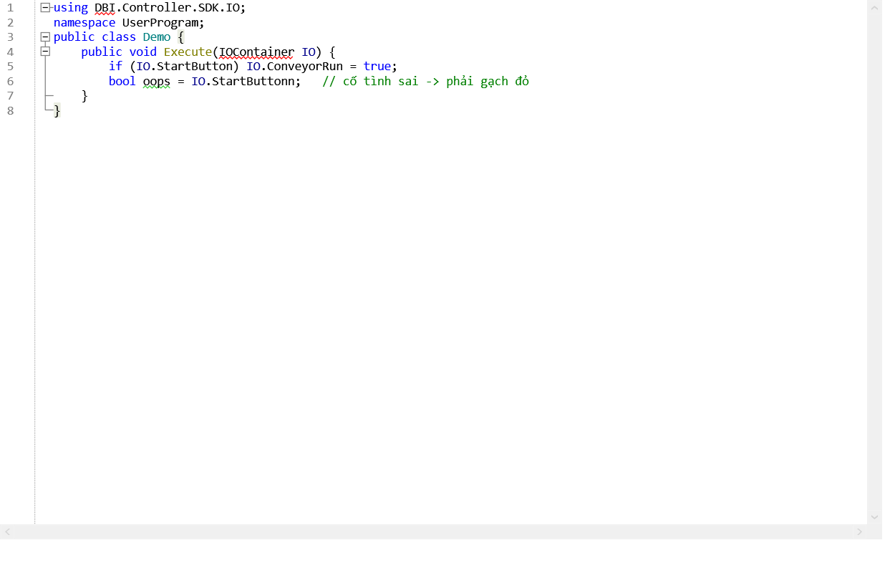
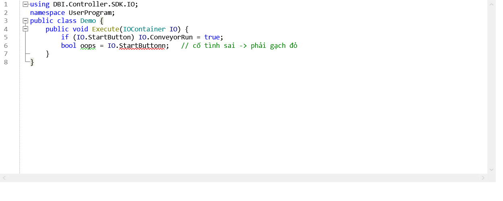

# Spike Report — RoslynPad.Editor

**Ngày:** 2026-07-27 | **Phase:** 00 | **Quyết định phụ thuộc:** phase-08

# ✅ KẾT LUẬN: DÙNG ĐƯỢC

**10/10 test PASS.** Phase-08 chạy phương án đầy đủ (IntelliSense Roslyn), **không** cần phương án lùi ở Task 08.6.

**Kèm 1 điều kiện bắt buộc:** ghim `Microsoft.CodeAnalysis.CSharp` về **5.3.0** (hiện Studio đang dùng 5.6.0).

---

## Môi trường

| Mục | Giá trị |
|---|---|
| SDK | 10.0.302 |
| Runtime | .NET 10.0.10, Windows 11 (10.0.26200) |
| `RoslynPad.Editor.Windows` | 5.0.0 |
| `AvalonEdit` | 6.3.1.120 |
| TFM | `net10.0-windows` |

---

## 🔴 Phát hiện 1 — Xung đột version Roslyn (có thật, nhưng giải được)

`RoslynPad.Roslyn` 5.0.0 khai báo phụ thuộc Roslyn ở **đúng phiên bản 5.3.0**:

```
Microsoft.CodeAnalysis.CSharp             = 5.3.0
Microsoft.CodeAnalysis.CSharp.Features    = 5.3.0
Microsoft.CodeAnalysis.CSharp.Scripting   = 5.3.0
Microsoft.CodeAnalysis.CSharp.Workspaces  = 5.3.0
```

Studio đang ghim `Microsoft.CodeAnalysis.CSharp` **5.6.0** → NuGet nâng một phần, giữ nguyên phần còn lại, tạo ra **assembly nạp lệch nhau**:

```
Microsoft.CodeAnalysis                    asm=5.6.0.0   ← bị nâng
Microsoft.CodeAnalysis.CSharp             asm=5.6.0.0   ← bị nâng
Microsoft.CodeAnalysis.Features           asm=5.3.0.0   ← giữ nguyên
Microsoft.CodeAnalysis.CSharp.Features    asm=5.3.0.0   ← giữ nguyên
Microsoft.CodeAnalysis.Workspaces         asm=5.3.0.0   ← giữ nguyên
Microsoft.CodeAnalysis.CSharp.Workspaces  asm=5.3.0.0   ← giữ nguyên
```

Kết quả **9 cảnh báo NU1608**.

### So sánh hai cấu hình

| | Roslyn 5.6.0 (hiện tại) | Roslyn 5.3.0 (ghim) |
|---|---|---|
| Cảnh báo NU1608 | **9** | **0** |
| Version assembly | Lệch nhau | Đồng bộ 5.3.0.0 |
| Test chức năng | **10/10 PASS** | **10/10 PASS** |

**Đáng chú ý:** cấu hình trộn version *vẫn chạy đúng* — không có `MissingMethodException` hay `TypeLoadException`. Nhưng đây là **may mắn, không phải bảo đảm**. Roslyn ship theo bộ khớp chặt; một bản vá 5.6.x sau này đổi signature nội bộ là hỏng ngay, mà lỗi sẽ xuất hiện lúc chạy chứ không phải lúc build.

### 👉 Việc phải làm

Trong [DBI.Controller.Studio.csproj](../../../src/DBI.Controller.Studio/DBI.Controller.Studio.csproj):

```diff
- <PackageReference Include="Microsoft.CodeAnalysis.CSharp" Version="5.6.0" />
+ <PackageReference Include="Microsoft.CodeAnalysis.CSharp" Version="5.3.0" />
```

Nên đặt ở `Directory.Build.props` hoặc `Directory.Packages.props` để `RoslynCompilerService` (phase-07) và `StudioWorkspace` (phase-08) **luôn dùng chung một version** — lệch nhau sẽ khiến IntelliSense và Compile báo lỗi khác nhau, làm người dùng mất niềm tin.

---

## 🔴 Phát hiện 2 — `RoslynHost` phải tạo SAU khi WPF `Application` tồn tại

Tạo `RoslynHost` trong `Main()` trước khi có `Application`:

```
ArgumentNullException: Value cannot be null. (Parameter 'context')
```

Nguyên nhân: RoslynPad 5 dùng `Microsoft.VisualStudio.Threading`, cần `SynchronizationContext` — chưa tồn tại trước khi WPF `Application` khởi động.

**Việc phải làm (phase-08):** khởi tạo `RoslynHost` trong `Application.Startup` hoặc muộn hơn, **không** trong `Main()` hay static constructor.

---

## 🔴 Phát hiện 3 — `AddRelatedDocument` KHÔNG dùng cho project nhiều file

```
InvalidOperationException: The solution already contains the specified reference.
```

`RoslynHost.AddDocument` / `AddRelatedDocument` thiết kế cho kịch bản **scripting** của RoslynPad: mỗi document là một project riêng. Không hợp với Studio (một project, nhiều file `Blocks/*.cs` + `Generated/IO.g.cs`).

**Cách đúng** — dựng project thật qua workspace:

```csharp
var ws     = host.CreateWorkspace();
var projId = ProjectId.CreateNewId("UserProgram");

var docInfos = files.Select(f => DocumentInfo.Create(
    DocumentId.CreateNewId(projId, f.Name), f.Name,
    loader: TextLoader.From(TextAndVersion.Create(SourceText.From(f.Text), VersionStamp.Create())),
    filePath: Path.Combine(projectDir, f.Name))).ToImmutableArray();

var projInfo = ProjectInfo.Create(projId, VersionStamp.Create(), "UserProgram", "UserProgram",
    LanguageNames.CSharp,
    compilationOptions: new CSharpCompilationOptions(OutputKind.DynamicallyLinkedLibrary),
    parseOptions:       host.ParseOptions,
    documents:          docInfos,
    metadataReferences: host.DefaultReferences);

ws.SetCurrentSolution(ws.CurrentSolution.AddProject(projInfo));
```

Đã kiểm chứng: 1 project × 6 file, partial class ghép đúng qua 2 file, tham chiếu chéo giữa các file resolve sạch.

---

## 🔴 Phát hiện 4 — `RoslynCodeEditor.InitializeAsync` tạo project CÔ LẬP 1 file

**Đây là phát hiện quan trọng nhất của spike.**

Gọi `editor.InitializeAsync(host, ...)` theo cách thông thường → editor tự tạo một project riêng chỉ chứa đúng văn bản truyền vào. Nó **không thấy** các file khác của project.

### Bằng chứng bằng hình

**Trước — editor mặc định (project cô lập):**



**Sau — nối vào project nhiều file:**



| Token | Editor mặc định | Sau khi nối |
|---|---|---|
| `using DBI.Controller.SDK.IO;` | 🔴 gạch đỏ (CS0234) | ✅ sạch |
| `IOContainer` | 🔴 gạch đỏ (CS0246) | ✅ sạch, tô đúng màu type |
| `IO.StartButtonn` *(cố tình sai)* | ✅ không gạch — **sai!** | 🔴 **gạch đỏ đúng chỗ** (CS1061) |

Editor mặc định không những vô dụng mà còn **gây hiểu nhầm**: nó báo lỗi ở chỗ đúng và bỏ qua chỗ sai.

### Cách nối (đã kiểm chứng)

```csharp
var docId = await editor.InitializeAsync(host, colors, dir, text, SourceCodeKind.Regular);

// Lấy workspace RoslynPad tự tạo, bổ sung các file còn lại vào cùng project
var edDoc = host.GetDocument(docId)!;
var edWs  = (RoslynWorkspace)edDoc.Project.Solution.Workspace;
var sol   = edWs.CurrentSolution;
foreach (var f in otherProjectFiles)
    sol = sol.AddDocument(DocumentInfo.Create(
        DocumentId.CreateNewId(edDoc.Project.Id, f.Name), f.Name,
        loader: TextLoader.From(TextAndVersion.Create(SourceText.From(f.Text), VersionStamp.Create()))));
edWs.SetCurrentSolution(sol);
```

**Điểm mở rộng chính thức** (có thể sạch hơn, chưa thử):

```csharp
public class CreatingDocumentEventArgs : RoutedEventArgs {
    public AvalonEditTextContainer TextContainer { get; }
    public DocumentId DocumentId { get; set; }   // ← settable
}
editor.CreatingDocument += (s, e) => { /* tự tạo document trong project của mình */ e.DocumentId = myId; };
```

**Việc phải làm:** thêm task riêng vào phase-08 cho việc nối editor ↔ workspace. Đây **không** phải chuyện hiển nhiên và nếu bỏ qua thì IntelliSense sẽ chạy sai một cách âm thầm.

---

## 🟡 Phát hiện 5 — `SetCurrentSolution` không phát sự kiện → completion bị cũ

Khi Tag Table đổi, `Generated/IO.g.cs` được sinh lại. Thử cập nhật bằng `WithDocumentText`:

```
SetCurrentSolution → text đã đổi = True
compilation thấy CycleCounter    = True
completion vẫn hiện danh sách CŨ ❌
```

Compilation đã thấy tag mới nhưng completion thì không. Nguyên nhân: `Workspace.SetCurrentSolution(Solution)` **không phát workspace change event**, nên cache của completion service không bị vô hiệu hoá.

`TryApplyChanges` cũng vô dụng — trả `true` nhưng text không đổi.

**Cách chạy được:** dựng lại project trong workspace khi Tag Table thay đổi. Đã kiểm chứng ✅.

**Việc phải làm (phase-06 + phase-08):** sau khi sinh lại `IO.g.cs`, **dựng lại project trong workspace**, không patch từng document. Với vài chục file thì chi phí không đáng kể.

---

## ✅ Phát hiện 6 — ADR-002 được kiểm chứng đầu-cuối

Toàn bộ lời hứa của [ADR-002](../decisions/ADR-002-tag-source-of-truth.md) đều đúng trên thực tế:

| Kiểm tra | Kết quả |
|---|---|
| Gõ `IO.` gợi ý đủ tag đã khai báo | ✅ `StartButton`, `ConveyorRun`, `Temperature` (13 mục tổng) |
| Gõ sai `IO.StartButtonn` | ✅ **CS1061** — bug B-1 chết hoàn toàn |
| Ghi vào tag `Input` | ✅ **CS0200** *(Property cannot be assigned — read only)* |
| `partial class` ghép giữa file tay và file sinh | ✅ thấy cả `StartButton` (sinh) lẫn `GetBool` (viết tay) |
| Sinh lại `IO.g.cs` → completion thấy tag mới | ✅ (bằng cách dựng lại project) |

---

## Bảng test đầy đủ

| ID | Nội dung | 5.6.0 | 5.3.0 |
|---|---|---|---|
| T1 | Khởi tạo `RoslynHost` (MEF composition) | ✅ | ✅ |
| T2 | Dựng project 1 × 6 file qua `SetCurrentSolution` | ✅ | ✅ |
| T3 | `partial class` ghép qua 2 file | ✅ | ✅ |
| T4 | Tham chiếu chéo giữa các file, 0 lỗi | ✅ | ✅ |
| T5 | Completion `IO.` đủ 3 tag | ✅ | ✅ |
| T6 | Bắt lỗi gõ sai tag (CS1061) | ✅ | ✅ |
| T7 | Chặn ghi vào tag Input (CS0200) | ✅ | ✅ |
| T7b | Sinh lại `IO.g.cs` → completion cập nhật | ✅ | ✅ |
| T8 | Dựng `RoslynCodeEditor` trên WPF | ✅ | ✅ |
| T9 | Nối editor vào project nhiều file | ✅ | ✅ |
| | **Tổng** | **10/10** | **10/10** |

Editor xác nhận có: syntax highlighting · line numbers · code folding · brace completion · squiggles.

---

## Việc cần thêm vào plan

| # | Việc | Phase |
|---|---|---|
| 1 | Ghim `Microsoft.CodeAnalysis.CSharp` = **5.3.0**, đặt ở `Directory.Build.props` | 00 |
| 2 | Khởi tạo `RoslynHost` sau khi WPF `Application` chạy | 08 |
| 3 | Dùng `CreateWorkspace` + `ProjectInfo`, **không** dùng `AddRelatedDocument` | 08 |
| 4 | **Task mới:** nối `RoslynCodeEditor` vào workspace của project | 08 |
| 5 | Tag Table đổi → **dựng lại project**, không patch document | 06, 08 |
| 6 | Compile (phase-07) và IntelliSense (phase-08) dùng **chung bộ reference** | 07, 08 |
